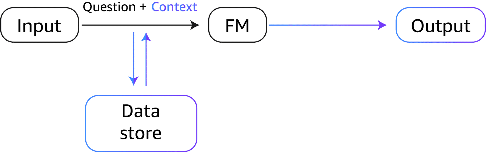

# My AWS Bedrock Learning Notes

These are my personal notes and learnings as I explore AWS Bedrock. I'm documenting my journey to understand how to build generative AI applications using Amazon's fully managed service.

## AI Concepts

### Tokens

When I send a prompt to an LLM, it doesn't read it the way I do. Instead, it breaks my text into smaller pieces called **tokens** using a Tokenizer service. Think of tokens as the building blocks that the model actually processes.

A token can be a whole word, part of a word, or even just a punctuation mark. For example:

- "Hello world!" might be broken into: `["Hello", " world", "!"]` (3 tokens)
- "I'm learning AWS" could become: `["I", "'m", " learning", " AWS"]` (4 tokens)
- "Tokenization" might split into: `["Token", "ization"]` (2 tokens)

### Tokenizer

A **tokenizer** is the tool that does the actual work of breaking text into tokens. It's like a translator that converts human language into a format the AI model can understand.

Different models use different tokenizers, and they don't all work the same way. For instance, one tokenizer might treat "don't" as a single token, while another splits it into "don" and "'t". Some are better at handling specific languages or technical terms.

### Embedding(Encoding)

**Embedding** is the process of converting tokens or text into numbers that represent their meaning. Since AI models can't actually "understand" words the way I do, they need to work with numbers instead.

Here's what happens: after my text is tokenized, each token gets transformed into a list of numbers called an embedding vector. These numbers capture the semantic meaning of the word - not just what it is, but what it means in context.

For example:
- The words "king" and "queen" would have similar embeddings because they're related concepts
- "King" and "car" would have very different embeddings because they're unrelated
- The word "bank" might have different embeddings depending on whether I'm talking about a river bank or a financial bank

What's cool is that embeddings capture relationships. If I do math with these number representations, I can find patterns like: "king" - "man" + "woman" ≈ "queen".

#### Why its called Embedding?
Its called "Embedding" because we are "Embedding(placing)" text into a numerical space where meaning can be compared.

```
from sentence_transformers import SentenceTransformer


# Load a small embedding model
model = SentenceTransformer("all-MiniLM-L6-v2")

# Text we want to convert to numbers
sentences = [
    "I am learning AWS AI Service SageMaker",
    "I am learning AWS AI Service BedRock",
    "I am learning AWS AI Service BedRock AgentCore"
]

# Convert text to embeddings (vectors)
embeddings = model.encode(sentences)
print(embeddings)

for sentence, embedding in zip(sentences, embeddings):
    print(f"\nSentence: {sentence}")
    print(f"Embedding length: {len(embedding)}")
    print(f"First 5 numbers: {embedding[:5]}")
```

### Vectors


*Image source: [Word Embedding by Hari Om](https://medium.com/@hari4om/word-embedding-d816f643140)*
- is the result of 'embedding' process. vector is a list of numbers. Its a 'n' dimensional list.
- Embeddings are stored as vectors.
- Vector size is chosen by the model designer during training. Basically the goal is to capture the meaning without wasting compute.
- More dimensions means more memory and slower search.
- Similar sentences --> vectors move closer, Different sentences --> vectors move apart

### Decoder

Once text has been converted into vector representations (embeddings), the **Decoder** in the Transformer algorithm takes over to generate the output I'm looking for. This is where the magic happens - where numbers turn back into meaningful text.

Here's how it works: The decoder looks at those vector representations and starts predicting what should come next, one word at a time. For each position, it calculates a **probability** for every possible word in its vocabulary. 

For example, if I ask "What is the capital of France?", after processing my question, the decoder might predict:
- "Paris" (85% probability)
- "London" (5% probability)  
- "Berlin" (3% probability)
- "Rome" (2% probability)
- ... and so on for thousands of other words

The word with the highest probability - in this case "Paris" - is usually selected as the next word in the response. Then the process repeats, using the newly generated word as context to predict the next one, and so on until the complete answer is formed.

### Context

**Context** is all the information the model has available when generating a response. It's like the model's working memory - everything it can "see" and use to understand what I'm asking and how to respond.

The context includes:
- My current prompt or question
- The conversation history (previous messages in the chat)
- Any system prompts that set the model's behavior
- Additional information I provide (like documents or data)

Think of it like having a conversation with someone. If I just say "What about that?", they need context from our earlier conversation to know what "that" refers to. Same with LLMs - the more relevant context they have, the better they can understand and respond.

In AWS Bedrock, context is important because:
- Models have a **context window** - a limit on how much text they can process at once (measured in tokens)
- Everything in the context counts toward this limit and affects cost
- If my conversation gets too long, older messages might get cut off
- I can use techniques like RAG (Retrieval Augmented Generation) to provide relevant context without overwhelming the model

Managing context well means I get better responses while keeping costs reasonable.


## Prompt Engineering

In prompt engineering, we structure prompts so the model knows:

- **Who it is and what should the model do** (Instructions) :- Instructions tell the model how to behave and what task to perform.
- **What information to use** (Context) :- Context gives background information the model needs to answer correctly.
- **What task to perform** (Input Data) :- Input data is the actual content the model must process.
- **How to respond** (Output Indicator) :- Output indicators define the format and structure of the response.

```
# Example Prompt Engineering
Instructions:
You are a restaurant order processor.
Verify the order and calculate the total bill.

Context:
The restaurant charges 8% tax.
Free delivery is available for orders above $30.

Input Data:
Order:
- 2 Veg Burgers ($8 each)
- 1 Fries ($5)
- 1 Soda ($3)

Output Indicator:
Return:
1. Itemized bill
2. Tax amount
3. Final total
4. Delivery charge (if any)

```

### Prompt Engineering Techniques
- **Zero Shot Prompting** :- We ask the model to do something without giving any examples.
- **Few Shot Prompting** :- We give a few examples so the model learns the pattern.

```
Convert text to sentiment.

Text: "I love AI"
Sentiment: Positive

Text: "This deployment failed"
Sentiment: Negative

Text: "The service is okay"
Sentiment:
```
- **Chain of Thought(CoT)** :- We ask the model to think step by step before answering.

```
A server costs $10 per day.
It runs for 7 days.
Explain step by step how to calculate the total cost.
```

#### Advanced Prompt Engineering Techniques
**TODO:** Read more about these options

- **Self Consistency**
- **Tree of Thought**
- **RAG** :- In this technique "We provide domain related data as 'context' to produce response based on the data and the prompt".




- **ART(Automatic Reasoning and Tool Use)**
- 

## Bedrock Foundational Models
- Some inference parameters like 'temperature', 'top_p', 'top_k' are common across all models but each model can provide additional inference parameters.

### Bedrock Methods

**TODO:** Need to write python code for each individual method.

- ListFoundationModels :- Lists all foundational models available. [Code Example](../code/bedrock_listfoundational_models.py)
- InvokeModel :- Invoke the specified model to run inference with the input provided.
- InvokeModelWithResponseStream :- Same as above but response is returned in stream.
- Converse :- is a higher level, standarized API for chatting with Bedrock models. Using this method we don't need to learn every model's custom request/response format. One common request/response formal for any Bedrock foundational models.


## Bedrock Foundational Models Settings

### Inference Settings

#### Randomness and diversity
**Temperature, top_k, and top_p** control how an AI model picks the *next word* when generating text.

Suppose the model predicts the next word with probabilities:
- "cat" (40%)
- "dog" (30%)
- "rabbit" (15%)
- "car" (10%)
- "tree" (5%)

- **Temperature** controls creativity. Low temperature picks safer words like **"cat"**, while higher temperature allows more variety like **"rabbit"** or **"car"**.
- **top_k = 2** means the model can only choose from the top 2 words: **"cat"** and **"dog"**.
- **top_p = 0.85** means the model picks from the smallest set of words whose **cumulative probability** reaches 85% → **"cat" (40%) + "dog" (30%) + "rabbit" (15%) = 85%**.

In short: temperature controls *randomness*, top_k limits *how many words*, and top_p limits *how much total probability*.

#### Length


### Inference Types
- **Max Length** :- maximum number of tokens that the model can generate during the inference process.
- **Stop Sequences** :- special tokens or sequences of tokens that signal the model to stop generating further output. 
**TODO:** Read more about these options

- **On Demand**
- **Inference Profiles**
- **Provisioned Throughput**


### System Prompt

In AWS Bedrock, a System Prompt is used to set the behavior, role, and rules for the Large Language Model (LLM) before it responds to user input.

```
# System Prompt Example
You are an AWS AI expert.
Explain concepts in simple language for beginners.
Use examples related to AWS services.
```

The model will now consistently respond like an AWS expert and keep explanations beginner-friendly — even if the user doesn’t repeat that instruction.

## Building Generative AI Applications


## Building Generative AI Applications

### Why Foundation Models Hallucinate with Enterprise Data

Foundation models are trained on massive amounts of public internet data - books, articles, websites, and more. But they've never seen:
- My company's internal documents
- Our product specifications
- Customer data from our databases
- Recent updates or changes in our systems
- Proprietary information that's not publicly available

So when I ask question like "Give me all critical security issues found with last run of Prowler tool", FM model will "hallucinate" because it doesn't know anything about this Prowler tool data. 

### How to input Enterprise Data into FM model
**TODO:** Read and implement more about these options
 
 There are ways to give foundation models access to enterprise data below are few.

**1. Retrieval Augmented Generation (RAG)**
This is the most common approach. When I ask a question:
- The system first searches my enterprise data (documents, databases, etc.)
- It retrieves the most relevant information
- It includes that information in the prompt as context
- The model generates an answer based on the actual data provided

**2. Fine-tuning**
I can take a pre-trained model and continue training it on my specific data. This helps the model learn:
- My company's terminology and jargon
- Common patterns in our data
- Domain-specific knowledge

However, fine-tuning is more expensive and doesn't work well for frequently changing data.

**3. Prompt Engineering with Context**
Sometimes the simplest approach works - I just include the relevant data directly in my prompt:

**4. Knowledge Bases (AWS Bedrock Feature)**
AWS Bedrock offers Knowledge Bases that automatically:
- Store my enterprise documents
- Create embeddings for semantic search
- Retrieve relevant information when I query
- Integrate seamlessly with foundation models

This is essentially managed RAG - AWS handles the complexity for me.

