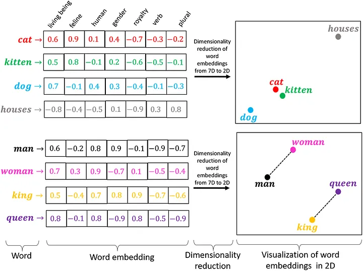

# My AWS Bedrock Learning Notes

These are my personal notes and learnings as I explore AWS Bedrock. I'm documenting my journey to understand how to build generative AI applications using Amazon's fully managed service.

## AI Concepts

### Tokens

When I send a prompt to an LLM, it doesn't read it the way I do. Instead, it breaks my text into smaller pieces called **tokens** using a Tokenizer service. Think of tokens as the building blocks that the model actually processes.

A token can be a whole word, part of a word, or even just a punctuation mark. For example:

- "Hello world!" might be broken into: `["Hello", " world", "!"]` (3 tokens)
- "I'm learning AWS" could become: `["I", "'m", " learning", " AWS"]` (4 tokens)
- "Tokenization" might split into: `["Token", "ization"]` (2 tokens)

### Tokenizer

A **tokenizer** is the tool that does the actual work of breaking text into tokens. It's like a translator that converts human language into a format the AI model can understand.

Different models use different tokenizers, and they don't all work the same way. For instance, one tokenizer might treat "don't" as a single token, while another splits it into "don" and "'t". Some are better at handling specific languages or technical terms.

### Embedding(Encoding)

**Embedding** is the process of converting tokens or text into numbers that represent their meaning. Since AI models can't actually "understand" words the way I do, they need to work with numbers instead.

Here's what happens: after my text is tokenized, each token gets transformed into a list of numbers called an embedding vector. These numbers capture the semantic meaning of the word - not just what it is, but what it means in context.

For example:
- The words "king" and "queen" would have similar embeddings because they're related concepts
- "King" and "car" would have very different embeddings because they're unrelated
- The word "bank" might have different embeddings depending on whether I'm talking about a river bank or a financial bank

What's cool is that embeddings capture relationships. If I do math with these number representations, I can find patterns like: "king" - "man" + "woman" ≈ "queen".

#### Why its called Embedding?
Its called "Embedding" because we are "Embedding(placing)" text into a numerical space where meaning can be compared.

```
from sentence_transformers import SentenceTransformer


# Load a small embedding model
model = SentenceTransformer("all-MiniLM-L6-v2")

# Text we want to convert to numbers
sentences = [
    "I am learning AWS AI Service SageMaker",
    "I am learning AWS AI Service BedRock",
    "I am learning AWS AI Service BedRock AgentCore"
]

# Convert text to embeddings (vectors)
embeddings = model.encode(sentences)
print(embeddings)

for sentence, embedding in zip(sentences, embeddings):
    print(f"\nSentence: {sentence}")
    print(f"Embedding length: {len(embedding)}")
    print(f"First 5 numbers: {embedding[:5]}")
```

### Vectors



*Image source: [Word Embedding by Hari Om](https://medium.com/@hari4om/word-embedding-d816f643140)*
- is the result of 'embedding' process. vector is a list of numbers. Its a 'n' dimensional list.
- Embeddings are stored as vectors.
- Vector size is chosen by the model designer during training. Basically the goal is to capture the meaning without wasting compute.
- More dimensions means more memory and slower search.
- Similar sentences --> vectors move closer, Different sentences --> vectors move apart

### Decoder

Once text has been converted into vector representations (embeddings), the **Decoder** in the Transformer algorithm takes over to generate the output I'm looking for. This is where the magic happens - where numbers turn back into meaningful text.

Here's how it works: The decoder looks at those vector representations and starts predicting what should come next, one word at a time. For each position, it calculates a **probability** for every possible word in its vocabulary. 

For example, if I ask "What is the capital of France?", after processing my question, the decoder might predict:
- "Paris" (85% probability)
- "London" (5% probability)  
- "Berlin" (3% probability)
- "Rome" (2% probability)
- ... and so on for thousands of other words

The word with the highest probability - in this case "Paris" - is usually selected as the next word in the response. Then the process repeats, using the newly generated word as context to predict the next one, and so on until the complete answer is formed.

## Bedrock Foundational Models Settings

### LLM Model response Settings
**Temperature, top_k, and top_p** control how an AI model picks the *next word* when generating text.

Suppose the model predicts the next word with probabilities:
- "cat" (40%)
- "dog" (30%)
- "rabbit" (15%)
- "car" (10%)
- "tree" (5%)

- **Temperature** controls creativity. Low temperature picks safer words like **"cat"**, while higher temperature allows more variety like **"rabbit"** or **"car"**.
- **top_k = 2** means the model can only choose from the top 2 words: **"cat"** and **"dog"**.
- **top_p = 0.85** means the model picks from the smallest set of words whose **cumulative probability** reaches 85% → **"cat" (40%) + "dog" (30%) + "rabbit" (15%) = 85%**.

In short: temperature controls *randomness*, top_k limits *how many words*, and top_p limits *how much total probability*.

### Inference Settings

**TODO:** Read more about these options

- **On Demand**
- **Inference Profiles**
- **Provisioned Throughput**


### System Prompt

In AWS Bedrock, a System Prompt is used to set the behavior, role, and rules for the Large Language Model (LLM) before it responds to user input.

```
# System Prompt Example
You are an AWS AI expert.
Explain concepts in simple language for beginners.
Use examples related to AWS services.
```

The model will now consistently respond like an AWS expert and keep explanations beginner-friendly — even if the user doesn’t repeat that instruction.


